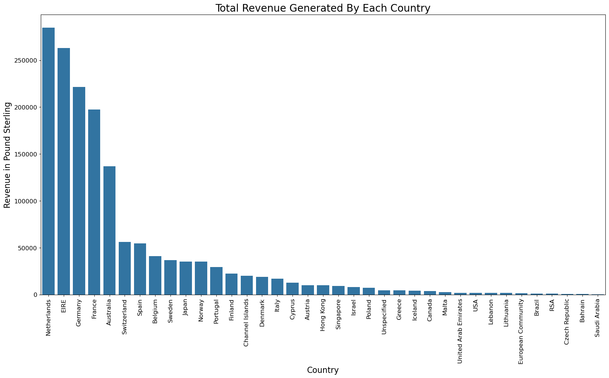
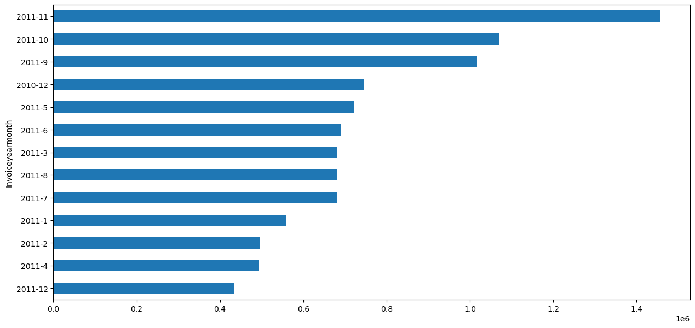
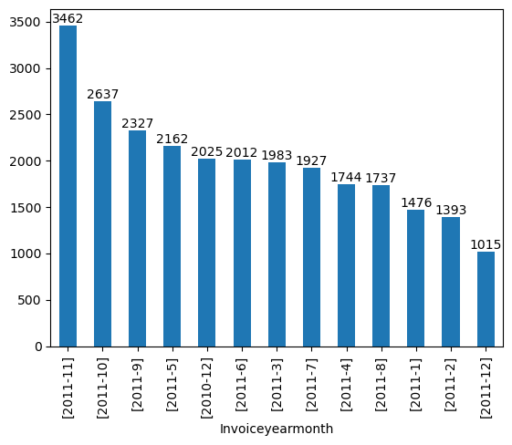
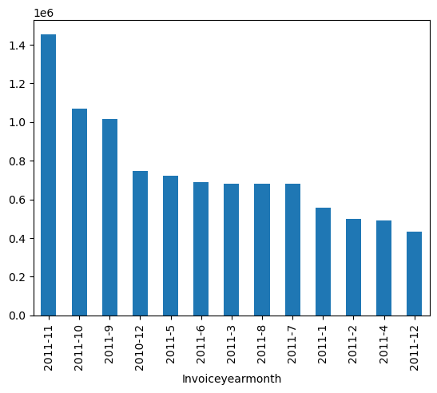
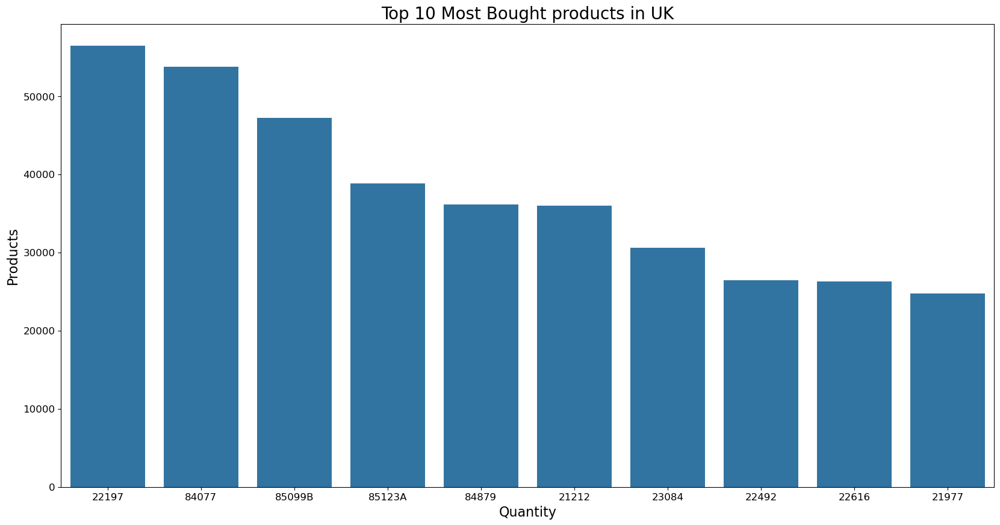
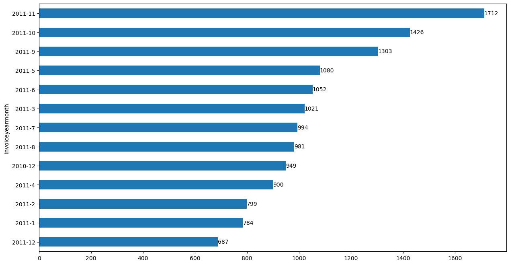

# <center><b> Retail Stores Sales Analysis <b></center>


```python
'''EDA
(4'. Sec Data Acq)
1. Introduction - just enough - 3 paras + 3 images.
2. Problem statement - Objective (mathematical) - measurable MIN/MAX
3. import libs/ system ready/excel - logistics
4. Data Acq - primary and sec
5. Pre profiling - check if there are any issues
 - outlier - BOXplot, describe
 - duplicates - .duplicated()
 - misssing values - .info()
 - inconstancy in dtypes - know what the type should be, info can see what it actually is.
 - typos - check for value_counts() or unique()
 - format - check by unique
6. pre processing
 - outlier - drop - dependent of the objective - contextual
 - duplicates - .drop_duplicates() - contextual
 - misssing values - fillna(mean/median/mode) or delete the row/column.
 - inconstancy in dtypes - .astype()
 - typos - replace
 - format - replace
 7. Post profiling - trust but verify
 8. EDA - asking relevatn qss - 15 +-5.
 9. Conclude - Action - PREP - point reason example point.

'''
```


    "EDA\n(4'. Sec Data Acq)\n1. Introduction - just enough - 3 paras + 3 images.\n2. Problem statement - Objective (mathematical) - measurable MIN/MAX\n3. import libs/ system ready/excel - logistics\n4. Data Acq - primary and sec\n5. Pre profiling - check if there are any issues\n - outlier - BOXplot, describe\n - duplicates - .duplicated()\n - misssing values - .info()\n - inconstancy in dtypes - know what the type should be, info can see what it actually is.\n - typos - check for value_counts() or unique()\n - format - check by unique\n6. pre processing\n - outlier - drop - dependent of the objective - contextual\n - duplicates - .drop_duplicates() - contextual\n - misssing values - fillna(mean/median/mode) or delete the row/column.\n - inconstancy in dtypes - .astype()\n - typos - replace\n - format - replace\n 7. Post profiling - trust but verify\n 8. EDA - asking relevatn qss - 15 +-5.\n 9. Conclude - Action - PREP - point reason example point.\n\n"


---
# **Table of Contents**
---

**1.** [**Introduction**](#Section1)<br>
**2.** [**Problem Statement**](#Section2)<br>
**3.** [**Installing & Importing Libraries**](#Section3)<br>
  - **3.1** [**Installing Libraries**](#Section31)
  - **3.2** [**Upgrading Libraries**](#Section32)
  - **3.3** [**Importing Libraries**](#Section33)

**4.** [**Data Acquisition & Description**](#Section4)<br>
  - **4.1** [**Data Description**](#Section41)
  - **4.2** [**Data Information**](#Section42)

**5.** [**Data Pre-Profiling**](#Section5)<br>
**6.** [**Data Cleaning**](#Section6)<br>
**7.** [**Data Post-Profiling**](#Section7)<br>
**8.** [**Exploratory Data Analysis**](#Section8)<br>
**9.** [**Summarization**](#Section9)<br>
  - **9.1** [**Conclusion**](#Section91)<br>
  - **9.2** [**Actionable Insights**](#Section92)<br>

---
<a name = Section1></a>
# **1. Introduction**
---

- Recently, it has been recognized that **precision marketing** has become a key means of generating profit.

- The availability of customer data and transaction records provides better understanding of customers’ **buying behaviors** and **preferences**.

- In the increasingly **competitive environment**, enterprises have to create a decision-making model for precision marketing.


- The case study considers a **marketing problem** where an online retailer provides different all-occasion gift products.

- This case study demonstrates that our **proposed decisions** and insights are capable of providing a good **precision marketing strategy**.

- The real-world data from a company in UK were collected and used in this case study. 

---
<a name = Section2></a>
# **2. Problem Statement**
---

- **The E-Shop** is an online retail company based in the **United Kingdom** (UK) that sells **unique all-occasion gifts**.

- They track online **traffic** on their website from **several countries** along with the UK on daily basis.

- In 2011, they observed a **hike in online traffic** at their e-retail shop.

- They plan to <font color="red">**segment customers**</font> and <font color="red">**target**</font> them with <font color="red">**advertisements**</font> based on their past purchases.

- They have hired a data scientist to guide them with the task. Let's say you are the data scientist they have approached.

- You have to analyze their **transactional data** from December 2010 to December 2011.

- You have to present an **initial investigation** on this data to check for various patterns, unusual transactions, cancellations, and bulk orders.

- This would be a **leading step** to help the company form proper customer segments.


---
<a name = Section3></a>
# **3. Installing and Importing Libraries**
---


```python
#-------------------------------------------------------------------------------------------------------------------------------
import pandas as pd                                                 # Importing for panel data analysis

#-------------------------------------------------------------------------------------------------------------------------------
import numpy as np                                                  # Importing package numpys (For Numerical Python)
#-------------------------------------------------------------------------------------------------------------------------------
import matplotlib.pyplot as plt                                     # Importing pyplot interface of matplotlib
import seaborn as sns                                               # Importing seaborn library for interactive visualization
%matplotlib inline
#-------------------------------------------------------------------------------------------------------------------------------
import datetime                                                     # For datetime operations
#-------------------------------------------------------------------------------------------------------------------------------
import warnings                                                     # Importing warning to disable runtime warnings
warnings.filterwarnings("ignore")                                   # Warnings will appear only once
```

---
<a name = Section4></a>
# **4. Data Acquisition & Description**
---


- The dataset consists of information about the customers, transactions, and products of an online retail site.

| Records | Features | Dataset Size |
| :--: | :--: | :--: |
| 541909 | 8 | 22.6 MB | 

<br>

| # | Feature Name | Feature Description |
|:--:|:--|:--| 
|1| InvoiceNo | A 6-digit number uniquely assigned to each transaction. 'C' in the beginning indicates a Cancellation |
|2|StockCode | Product Code, a 5-digit number uniquely assigned to each distinct product |
|3| Description |	Product (item) Name |
|4| Quantity |	The quantities of each product (item) per transaction |
|5| InvoiceDate |	The day and time when each transaction was generated |
|6| UnitPrice |	Product price per unit in Sterling |
|7| CustomerID |	A 5-digit number uniquely assigned to each customer |
|8| Country |	The name of the country where each customer resides |

### Source


```python
data = pd.read_excel(io='https://github.com/insaid2018/Term-1/blob/master/Data/Casestudy/online_retail.xlsx?raw=true')
print('Shape of the dataset:', data.shape)
data.head()
```

    Shape of the dataset: (541909, 8)
    


<div>
<style scoped>
    .dataframe tbody tr th:only-of-type {
        vertical-align: middle;
    }

    .dataframe tbody tr th {
        vertical-align: top;
    }

    .dataframe thead th {
        text-align: right;
    }
</style>
<table border="1" class="dataframe">
  <thead>
    <tr style="text-align: right;">
      <th></th>
      <th>InvoiceNo</th>
      <th>StockCode</th>
      <th>Description</th>
      <th>Quantity</th>
      <th>InvoiceDate</th>
      <th>UnitPrice</th>
      <th>CustomerID</th>
      <th>Country</th>
    </tr>
  </thead>
  <tbody>
    <tr>
      <th>0</th>
      <td>536365</td>
      <td>85123A</td>
      <td>WHITE HANGING HEART T-LIGHT HOLDER</td>
      <td>6</td>
      <td>2010-12-01 08:26:00</td>
      <td>2.55</td>
      <td>17850.0</td>
      <td>United Kingdom</td>
    </tr>
    <tr>
      <th>1</th>
      <td>536365</td>
      <td>71053</td>
      <td>WHITE METAL LANTERN</td>
      <td>6</td>
      <td>2010-12-01 08:26:00</td>
      <td>3.39</td>
      <td>17850.0</td>
      <td>United Kingdom</td>
    </tr>
    <tr>
      <th>2</th>
      <td>536365</td>
      <td>84406B</td>
      <td>CREAM CUPID HEARTS COAT HANGER</td>
      <td>8</td>
      <td>2010-12-01 08:26:00</td>
      <td>2.75</td>
      <td>17850.0</td>
      <td>United Kingdom</td>
    </tr>
    <tr>
      <th>3</th>
      <td>536365</td>
      <td>84029G</td>
      <td>KNITTED UNION FLAG HOT WATER BOTTLE</td>
      <td>6</td>
      <td>2010-12-01 08:26:00</td>
      <td>3.39</td>
      <td>17850.0</td>
      <td>United Kingdom</td>
    </tr>
    <tr>
      <th>4</th>
      <td>536365</td>
      <td>84029E</td>
      <td>RED WOOLLY HOTTIE WHITE HEART.</td>
      <td>6</td>
      <td>2010-12-01 08:26:00</td>
      <td>3.39</td>
      <td>17850.0</td>
      <td>United Kingdom</td>
    </tr>
  </tbody>
</table>
</div>


```python
data.info()
```

    <class 'pandas.core.frame.DataFrame'>
    RangeIndex: 541909 entries, 0 to 541908
    Data columns (total 8 columns):
     #   Column       Non-Null Count   Dtype         
    ---  ------       --------------   -----         
     0   InvoiceNo    541909 non-null  object        
     1   StockCode    541909 non-null  object        
     2   Description  540455 non-null  object        
     3   Quantity     541909 non-null  int64         
     4   InvoiceDate  541909 non-null  datetime64[ns]
     5   UnitPrice    541909 non-null  float64       
     6   CustomerID   406829 non-null  float64       
     7   Country      541909 non-null  object        
    dtypes: datetime64[ns](1), float64(2), int64(1), object(4)
    memory usage: 33.1+ MB
    


```python
'''
1. missing values in Description - delete the column
2. cust id - float - type casting to object
3. cust id missing - replace with ('guest') #every guest just visits onces
'''
```


    "\n1. missing values in Description - delete the column\n2. cust id - float - type casting to object\n3. cust id missing - replace with ('guest') #every guest just visits onces\n"


<a name = Section41></a>
### **4.1 Data Description**


```python
data.describe()
```


<div>
<style scoped>
    .dataframe tbody tr th:only-of-type {
        vertical-align: middle;
    }

    .dataframe tbody tr th {
        vertical-align: top;
    }

    .dataframe thead th {
        text-align: right;
    }
</style>
<table border="1" class="dataframe">
  <thead>
    <tr style="text-align: right;">
      <th></th>
      <th>Quantity</th>
      <th>InvoiceDate</th>
      <th>UnitPrice</th>
      <th>CustomerID</th>
    </tr>
  </thead>
  <tbody>
    <tr>
      <th>count</th>
      <td>541909.000000</td>
      <td>541909</td>
      <td>541909.000000</td>
      <td>406829.000000</td>
    </tr>
    <tr>
      <th>mean</th>
      <td>9.552250</td>
      <td>2011-07-04 13:34:57.156386048</td>
      <td>4.611114</td>
      <td>15287.690570</td>
    </tr>
    <tr>
      <th>min</th>
      <td>-80995.000000</td>
      <td>2010-12-01 08:26:00</td>
      <td>-11062.060000</td>
      <td>12346.000000</td>
    </tr>
    <tr>
      <th>25%</th>
      <td>1.000000</td>
      <td>2011-03-28 11:34:00</td>
      <td>1.250000</td>
      <td>13953.000000</td>
    </tr>
    <tr>
      <th>50%</th>
      <td>3.000000</td>
      <td>2011-07-19 17:17:00</td>
      <td>2.080000</td>
      <td>15152.000000</td>
    </tr>
    <tr>
      <th>75%</th>
      <td>10.000000</td>
      <td>2011-10-19 11:27:00</td>
      <td>4.130000</td>
      <td>16791.000000</td>
    </tr>
    <tr>
      <th>max</th>
      <td>80995.000000</td>
      <td>2011-12-09 12:50:00</td>
      <td>38970.000000</td>
      <td>18287.000000</td>
    </tr>
    <tr>
      <th>std</th>
      <td>218.081158</td>
      <td>NaN</td>
      <td>96.759853</td>
      <td>1713.600303</td>
    </tr>
  </tbody>
</table>
</div>


```python
'''
1. Quantity - there are outliers, we can study their validity.
2. unit price - negative - study, absolute value.
3. unit price - outliers - study, drop is needed.
'''
```


    '\n1. Quantity - there are outliers, we can study their validity.\n2. unit price - negative - study, absolute value.\n3. unit price - outliers - study, drop is needed.\n'


```python
# 1.missng value in description
# delete

data.drop('Description', axis = 1, inplace = True)
```


```python
data['CustomerID'] = data['CustomerID'].fillna(0)
```


```python
data.info()
```

    <class 'pandas.core.frame.DataFrame'>
    RangeIndex: 541909 entries, 0 to 541908
    Data columns (total 7 columns):
     #   Column       Non-Null Count   Dtype         
    ---  ------       --------------   -----         
     0   InvoiceNo    541909 non-null  object        
     1   StockCode    541909 non-null  object        
     2   Quantity     541909 non-null  int64         
     3   InvoiceDate  541909 non-null  datetime64[ns]
     4   UnitPrice    541909 non-null  float64       
     5   CustomerID   541909 non-null  float64       
     6   Country      541909 non-null  object        
    dtypes: datetime64[ns](1), float64(2), int64(1), object(3)
    memory usage: 28.9+ MB
    


```python
# 2. cust id - float - type casting to object

data['CustomerID'] = data['CustomerID'].astype(int).astype('str')
```


```python
data.info()
```

    <class 'pandas.core.frame.DataFrame'>
    RangeIndex: 541909 entries, 0 to 541908
    Data columns (total 7 columns):
     #   Column       Non-Null Count   Dtype         
    ---  ------       --------------   -----         
     0   InvoiceNo    541909 non-null  object        
     1   StockCode    541909 non-null  object        
     2   Quantity     541909 non-null  int64         
     3   InvoiceDate  541909 non-null  datetime64[ns]
     4   UnitPrice    541909 non-null  float64       
     5   CustomerID   541909 non-null  object        
     6   Country      541909 non-null  object        
    dtypes: datetime64[ns](1), float64(1), int64(1), object(4)
    memory usage: 28.9+ MB
    


```python
data['CustomerID'].unique()
```


    array(['17850', '13047', '12583', ..., '13298', '14569', '12713'],
          dtype=object)


```python
data['CustomerID'].sort_values()
```


    437603        0
    261044        0
    261045        0
    261046        0
    261047        0
              ...  
    198739    18287
    198738    18287
    198737    18287
    198743    18287
    392725    18287
    Name: CustomerID, Length: 541909, dtype: object


```python
data.info()
```

    <class 'pandas.core.frame.DataFrame'>
    RangeIndex: 541909 entries, 0 to 541908
    Data columns (total 7 columns):
     #   Column       Non-Null Count   Dtype         
    ---  ------       --------------   -----         
     0   InvoiceNo    541909 non-null  object        
     1   StockCode    541909 non-null  object        
     2   Quantity     541909 non-null  int64         
     3   InvoiceDate  541909 non-null  datetime64[ns]
     4   UnitPrice    541909 non-null  float64       
     5   CustomerID   541909 non-null  object        
     6   Country      541909 non-null  object        
    dtypes: datetime64[ns](1), float64(1), int64(1), object(4)
    memory usage: 28.9+ MB
    


```python
# 4. Quantity - there are outliers, we can study their validity.

data['Quantity'].describe()
```


    count    541909.000000
    mean          9.552250
    std         218.081158
    min      -80995.000000
    25%           1.000000
    50%           3.000000
    75%          10.000000
    max       80995.000000
    Name: Quantity, dtype: float64


```python
IQR = data.Quantity.describe()['75%'] - data.Quantity.describe()['25%']

low_range = data.Quantity.describe()['25%'] - 1.5*IQR
high_range = data.Quantity.describe()['75%'] + 1.5*IQR

print('Low range  : {} '.format(low_range))
print('High range : {} '.format(high_range))

```

    Low range  : -12.5 
    High range : 23.5 
    


```python
data = data[(data['Quantity']< 5000) | (data['Quantity']> -5000)]

```


```python
'''
7. a new feature can be created = returned / expired / outgo
8. duplicates
'''
```


    '\n7. a new feature can be created = returned / expired / outgo\n8. duplicates\n'


<a name = Section42></a>
### **4.2 Data Information**


```python
data.info()
```

    <class 'pandas.core.frame.DataFrame'>
    Index: 536639 entries, 0 to 541908
    Data columns (total 13 columns):
     #   Column            Non-Null Count   Dtype         
    ---  ------            --------------   -----         
     0   InvoiceNo         536639 non-null  object        
     1   StockCode         536639 non-null  object        
     2   Quantity          536639 non-null  int64         
     3   InvoiceDate       536639 non-null  datetime64[ns]
     4   UnitPrice         536639 non-null  float64       
     5   CustomerID        536639 non-null  object        
     6   Country           536639 non-null  object        
     7   Year              536639 non-null  int32         
     8   Month             536639 non-null  int32         
     9   Hour              536639 non-null  int32         
     10  Day               536639 non-null  int32         
     11  Revenue           536639 non-null  float64       
     12  Invoiceyearmonth  536639 non-null  object        
    dtypes: datetime64[ns](1), float64(2), int32(4), int64(1), object(5)
    memory usage: 49.1+ MB
    

**Observations:**

- There are **8 features** with **5,41,908 observations**.

- **Quantity** is of **int64** datatype.

- **UnitPrice** and **CustomerID** are of **float64** datatype.

- **InvoiceDate** is of **datetime64[ns]** datatype.

- **InvoiceNo**, **StockCode**, **Description**, and **Country** are of **object** datatypes

- We will have to make more sense of InvoiceNo and StockCode by exploring them further.

<a name = Section6></a>

---
# **6. Data Cleaning**
---


```python
# We will start by first removing the duplicate rows
data.drop_duplicates(inplace=True)

# Dropping rows containing missing values
data.dropna(inplace=True)

# Checking for missing values again
data.isna().sum()

# Extracting Year, Month, Day and Hour for every transaction
data['year'] = data['InvoiceDate'].dt.year
data['month'] = data['InvoiceDate'].dt.month
data['hour'] = data['InvoiceDate'].dt.hour

# We get Monday = 0 to Sunday = 6 when we convert to day of the week.
# We will add +1 to every day of week so we can get Monday = 1 to Sunday = 7
data['day'] = (data['InvoiceDate'].dt.dayofweek) + 1

data["Revenue"] = data["Quantity"] * data["UnitPrice"]

data.head()
```


<div>
<style scoped>
    .dataframe tbody tr th:only-of-type {
        vertical-align: middle;
    }

    .dataframe tbody tr th {
        vertical-align: top;
    }

    .dataframe thead th {
        text-align: right;
    }
</style>
<table border="1" class="dataframe">
  <thead>
    <tr style="text-align: right;">
      <th></th>
      <th>InvoiceNo</th>
      <th>StockCode</th>
      <th>Quantity</th>
      <th>InvoiceDate</th>
      <th>UnitPrice</th>
      <th>CustomerID</th>
      <th>Country</th>
      <th>Year</th>
      <th>Month</th>
      <th>Hour</th>
      <th>Day</th>
      <th>Revenue</th>
      <th>Invoiceyearmonth</th>
      <th>year</th>
      <th>month</th>
      <th>hour</th>
      <th>day</th>
    </tr>
  </thead>
  <tbody>
    <tr>
      <th>0</th>
      <td>536365</td>
      <td>85123A</td>
      <td>6</td>
      <td>2010-12-01 08:26:00</td>
      <td>2.55</td>
      <td>17850</td>
      <td>United Kingdom</td>
      <td>2010</td>
      <td>12</td>
      <td>8</td>
      <td>3</td>
      <td>15.30</td>
      <td>2010-12</td>
      <td>2010</td>
      <td>12</td>
      <td>8</td>
      <td>3</td>
    </tr>
    <tr>
      <th>1</th>
      <td>536365</td>
      <td>71053</td>
      <td>6</td>
      <td>2010-12-01 08:26:00</td>
      <td>3.39</td>
      <td>17850</td>
      <td>United Kingdom</td>
      <td>2010</td>
      <td>12</td>
      <td>8</td>
      <td>3</td>
      <td>20.34</td>
      <td>2010-12</td>
      <td>2010</td>
      <td>12</td>
      <td>8</td>
      <td>3</td>
    </tr>
    <tr>
      <th>2</th>
      <td>536365</td>
      <td>84406B</td>
      <td>8</td>
      <td>2010-12-01 08:26:00</td>
      <td>2.75</td>
      <td>17850</td>
      <td>United Kingdom</td>
      <td>2010</td>
      <td>12</td>
      <td>8</td>
      <td>3</td>
      <td>22.00</td>
      <td>2010-12</td>
      <td>2010</td>
      <td>12</td>
      <td>8</td>
      <td>3</td>
    </tr>
    <tr>
      <th>3</th>
      <td>536365</td>
      <td>84029G</td>
      <td>6</td>
      <td>2010-12-01 08:26:00</td>
      <td>3.39</td>
      <td>17850</td>
      <td>United Kingdom</td>
      <td>2010</td>
      <td>12</td>
      <td>8</td>
      <td>3</td>
      <td>20.34</td>
      <td>2010-12</td>
      <td>2010</td>
      <td>12</td>
      <td>8</td>
      <td>3</td>
    </tr>
    <tr>
      <th>4</th>
      <td>536365</td>
      <td>84029E</td>
      <td>6</td>
      <td>2010-12-01 08:26:00</td>
      <td>3.39</td>
      <td>17850</td>
      <td>United Kingdom</td>
      <td>2010</td>
      <td>12</td>
      <td>8</td>
      <td>3</td>
      <td>20.34</td>
      <td>2010-12</td>
      <td>2010</td>
      <td>12</td>
      <td>8</td>
      <td>3</td>
    </tr>
  </tbody>
</table>
</div>


<a name = Section7></a>

---
# **7. Data Post-Profiling**
---


**Observations**:

- There are **no missing values** in the dataset.

- There are **no duplicate values** in the dataset.

- **Description** feature shows **high cardinality**.

<a name = Section8></a>

---
# **8. Exploratory Data Analysis**
---


```python
data.head()
```


<div>
<style scoped>
    .dataframe tbody tr th:only-of-type {
        vertical-align: middle;
    }

    .dataframe tbody tr th {
        vertical-align: top;
    }

    .dataframe thead th {
        text-align: right;
    }
</style>
<table border="1" class="dataframe">
  <thead>
    <tr style="text-align: right;">
      <th></th>
      <th>InvoiceNo</th>
      <th>StockCode</th>
      <th>Quantity</th>
      <th>InvoiceDate</th>
      <th>UnitPrice</th>
      <th>CustomerID</th>
      <th>Country</th>
      <th>Year</th>
      <th>Month</th>
      <th>Hour</th>
      <th>Day</th>
      <th>Revenue</th>
      <th>Invoiceyearmonth</th>
    </tr>
  </thead>
  <tbody>
    <tr>
      <th>0</th>
      <td>536365</td>
      <td>85123A</td>
      <td>6</td>
      <td>2010-12-01 08:26:00</td>
      <td>2.55</td>
      <td>17850</td>
      <td>United Kingdom</td>
      <td>2010</td>
      <td>12</td>
      <td>8</td>
      <td>3</td>
      <td>15.30</td>
      <td>2010-12</td>
    </tr>
    <tr>
      <th>1</th>
      <td>536365</td>
      <td>71053</td>
      <td>6</td>
      <td>2010-12-01 08:26:00</td>
      <td>3.39</td>
      <td>17850</td>
      <td>United Kingdom</td>
      <td>2010</td>
      <td>12</td>
      <td>8</td>
      <td>3</td>
      <td>20.34</td>
      <td>2010-12</td>
    </tr>
    <tr>
      <th>2</th>
      <td>536365</td>
      <td>84406B</td>
      <td>8</td>
      <td>2010-12-01 08:26:00</td>
      <td>2.75</td>
      <td>17850</td>
      <td>United Kingdom</td>
      <td>2010</td>
      <td>12</td>
      <td>8</td>
      <td>3</td>
      <td>22.00</td>
      <td>2010-12</td>
    </tr>
    <tr>
      <th>3</th>
      <td>536365</td>
      <td>84029G</td>
      <td>6</td>
      <td>2010-12-01 08:26:00</td>
      <td>3.39</td>
      <td>17850</td>
      <td>United Kingdom</td>
      <td>2010</td>
      <td>12</td>
      <td>8</td>
      <td>3</td>
      <td>20.34</td>
      <td>2010-12</td>
    </tr>
    <tr>
      <th>4</th>
      <td>536365</td>
      <td>84029E</td>
      <td>6</td>
      <td>2010-12-01 08:26:00</td>
      <td>3.39</td>
      <td>17850</td>
      <td>United Kingdom</td>
      <td>2010</td>
      <td>12</td>
      <td>8</td>
      <td>3</td>
      <td>20.34</td>
      <td>2010-12</td>
    </tr>
  </tbody>
</table>
</div>


**<h4>Question:** How to verify for cancelled transactions?</h4>


```python
data.head()
```


```python
data.info()
```

    <class 'pandas.core.frame.DataFrame'>
    Index: 536639 entries, 0 to 541908
    Data columns (total 13 columns):
     #   Column            Non-Null Count   Dtype         
    ---  ------            --------------   -----         
     0   InvoiceNo         536639 non-null  object        
     1   StockCode         536639 non-null  object        
     2   Quantity          536639 non-null  int64         
     3   InvoiceDate       536639 non-null  datetime64[ns]
     4   UnitPrice         536639 non-null  float64       
     5   CustomerID        536639 non-null  object        
     6   Country           536639 non-null  object        
     7   Year              536639 non-null  int32         
     8   Month             536639 non-null  int32         
     9   Hour              536639 non-null  int32         
     10  Day               536639 non-null  int32         
     11  Revenue           536639 non-null  float64       
     12  Invoiceyearmonth  536639 non-null  object        
    dtypes: datetime64[ns](1), float64(2), int32(4), int64(1), object(5)
    memory usage: 49.1+ MB
    


```python
canc = data[data['InvoiceNo'].astype(str).str.startswith('C')]
print('Total number of cancelled orders: ', canc.shape[0])
canc
```

    Total number of cancelled orders:  9251
    


<div>
<style scoped>
    .dataframe tbody tr th:only-of-type {
        vertical-align: middle;
    }

    .dataframe tbody tr th {
        vertical-align: top;
    }

    .dataframe thead th {
        text-align: right;
    }
</style>
<table border="1" class="dataframe">
  <thead>
    <tr style="text-align: right;">
      <th></th>
      <th>InvoiceNo</th>
      <th>StockCode</th>
      <th>Quantity</th>
      <th>InvoiceDate</th>
      <th>UnitPrice</th>
      <th>CustomerID</th>
      <th>Country</th>
      <th>Year</th>
      <th>Month</th>
      <th>Hour</th>
      <th>Day</th>
      <th>Revenue</th>
      <th>Invoiceyearmonth</th>
    </tr>
  </thead>
  <tbody>
    <tr>
      <th>141</th>
      <td>C536379</td>
      <td>D</td>
      <td>-1</td>
      <td>2010-12-01 09:41:00</td>
      <td>27.50</td>
      <td>14527</td>
      <td>United Kingdom</td>
      <td>2010</td>
      <td>12</td>
      <td>9</td>
      <td>3</td>
      <td>-27.50</td>
      <td>2010-12</td>
    </tr>
    <tr>
      <th>154</th>
      <td>C536383</td>
      <td>35004C</td>
      <td>-1</td>
      <td>2010-12-01 09:49:00</td>
      <td>4.65</td>
      <td>15311</td>
      <td>United Kingdom</td>
      <td>2010</td>
      <td>12</td>
      <td>9</td>
      <td>3</td>
      <td>-4.65</td>
      <td>2010-12</td>
    </tr>
    <tr>
      <th>235</th>
      <td>C536391</td>
      <td>22556</td>
      <td>-12</td>
      <td>2010-12-01 10:24:00</td>
      <td>1.65</td>
      <td>17548</td>
      <td>United Kingdom</td>
      <td>2010</td>
      <td>12</td>
      <td>10</td>
      <td>3</td>
      <td>-19.80</td>
      <td>2010-12</td>
    </tr>
    <tr>
      <th>236</th>
      <td>C536391</td>
      <td>21984</td>
      <td>-24</td>
      <td>2010-12-01 10:24:00</td>
      <td>0.29</td>
      <td>17548</td>
      <td>United Kingdom</td>
      <td>2010</td>
      <td>12</td>
      <td>10</td>
      <td>3</td>
      <td>-6.96</td>
      <td>2010-12</td>
    </tr>
    <tr>
      <th>237</th>
      <td>C536391</td>
      <td>21983</td>
      <td>-24</td>
      <td>2010-12-01 10:24:00</td>
      <td>0.29</td>
      <td>17548</td>
      <td>United Kingdom</td>
      <td>2010</td>
      <td>12</td>
      <td>10</td>
      <td>3</td>
      <td>-6.96</td>
      <td>2010-12</td>
    </tr>
    <tr>
      <th>...</th>
      <td>...</td>
      <td>...</td>
      <td>...</td>
      <td>...</td>
      <td>...</td>
      <td>...</td>
      <td>...</td>
      <td>...</td>
      <td>...</td>
      <td>...</td>
      <td>...</td>
      <td>...</td>
      <td>...</td>
    </tr>
    <tr>
      <th>540449</th>
      <td>C581490</td>
      <td>23144</td>
      <td>-11</td>
      <td>2011-12-09 09:57:00</td>
      <td>0.83</td>
      <td>14397</td>
      <td>United Kingdom</td>
      <td>2011</td>
      <td>12</td>
      <td>9</td>
      <td>5</td>
      <td>-9.13</td>
      <td>2011-12</td>
    </tr>
    <tr>
      <th>541541</th>
      <td>C581499</td>
      <td>M</td>
      <td>-1</td>
      <td>2011-12-09 10:28:00</td>
      <td>224.69</td>
      <td>15498</td>
      <td>United Kingdom</td>
      <td>2011</td>
      <td>12</td>
      <td>10</td>
      <td>5</td>
      <td>-224.69</td>
      <td>2011-12</td>
    </tr>
    <tr>
      <th>541715</th>
      <td>C581568</td>
      <td>21258</td>
      <td>-5</td>
      <td>2011-12-09 11:57:00</td>
      <td>10.95</td>
      <td>15311</td>
      <td>United Kingdom</td>
      <td>2011</td>
      <td>12</td>
      <td>11</td>
      <td>5</td>
      <td>-54.75</td>
      <td>2011-12</td>
    </tr>
    <tr>
      <th>541716</th>
      <td>C581569</td>
      <td>84978</td>
      <td>-1</td>
      <td>2011-12-09 11:58:00</td>
      <td>1.25</td>
      <td>17315</td>
      <td>United Kingdom</td>
      <td>2011</td>
      <td>12</td>
      <td>11</td>
      <td>5</td>
      <td>-1.25</td>
      <td>2011-12</td>
    </tr>
    <tr>
      <th>541717</th>
      <td>C581569</td>
      <td>20979</td>
      <td>-5</td>
      <td>2011-12-09 11:58:00</td>
      <td>1.25</td>
      <td>17315</td>
      <td>United Kingdom</td>
      <td>2011</td>
      <td>12</td>
      <td>11</td>
      <td>5</td>
      <td>-6.25</td>
      <td>2011-12</td>
    </tr>
  </tbody>
</table>
<p>9251 rows × 13 columns</p>
</div>


### Observation
~ There are 9288 cancelled orders.
~ We can say that cancelled orders have a corresponding negative value in Quantity column.


```python
canc['InvoiceNo'].value_counts().sum()
```


    9251


**<h4>Question:** Does the Quantity feature consists of negative values for cancelled orders?</h4>


```python
canc[canc['Quantity']>=0].shape
```


    (0, 13)


### Observation
~ There are no single rows in Quantity with a value greater or equal to 0, assumption seems true.
~ Cross checking if all the negative values in dataset, has a corresponding Invoice No. that dont start with "C".


```python
data[(data['Quantity']<0) & (data['InvoiceNo'] != data['InvoiceNo'].astype(str).str.startswith('C'))]
```


<div>
<style scoped>
    .dataframe tbody tr th:only-of-type {
        vertical-align: middle;
    }

    .dataframe tbody tr th {
        vertical-align: top;
    }

    .dataframe thead th {
        text-align: right;
    }
</style>
<table border="1" class="dataframe">
  <thead>
    <tr style="text-align: right;">
      <th></th>
      <th>InvoiceNo</th>
      <th>StockCode</th>
      <th>Quantity</th>
      <th>InvoiceDate</th>
      <th>UnitPrice</th>
      <th>CustomerID</th>
      <th>Country</th>
      <th>Year</th>
      <th>Month</th>
      <th>Hour</th>
      <th>Day</th>
      <th>Revenue</th>
      <th>Invoiceyearmonth</th>
    </tr>
  </thead>
  <tbody>
    <tr>
      <th>141</th>
      <td>C536379</td>
      <td>D</td>
      <td>-1</td>
      <td>2010-12-01 09:41:00</td>
      <td>27.50</td>
      <td>14527</td>
      <td>United Kingdom</td>
      <td>2010</td>
      <td>12</td>
      <td>9</td>
      <td>3</td>
      <td>-27.50</td>
      <td>2010-12</td>
    </tr>
    <tr>
      <th>154</th>
      <td>C536383</td>
      <td>35004C</td>
      <td>-1</td>
      <td>2010-12-01 09:49:00</td>
      <td>4.65</td>
      <td>15311</td>
      <td>United Kingdom</td>
      <td>2010</td>
      <td>12</td>
      <td>9</td>
      <td>3</td>
      <td>-4.65</td>
      <td>2010-12</td>
    </tr>
    <tr>
      <th>235</th>
      <td>C536391</td>
      <td>22556</td>
      <td>-12</td>
      <td>2010-12-01 10:24:00</td>
      <td>1.65</td>
      <td>17548</td>
      <td>United Kingdom</td>
      <td>2010</td>
      <td>12</td>
      <td>10</td>
      <td>3</td>
      <td>-19.80</td>
      <td>2010-12</td>
    </tr>
    <tr>
      <th>236</th>
      <td>C536391</td>
      <td>21984</td>
      <td>-24</td>
      <td>2010-12-01 10:24:00</td>
      <td>0.29</td>
      <td>17548</td>
      <td>United Kingdom</td>
      <td>2010</td>
      <td>12</td>
      <td>10</td>
      <td>3</td>
      <td>-6.96</td>
      <td>2010-12</td>
    </tr>
    <tr>
      <th>237</th>
      <td>C536391</td>
      <td>21983</td>
      <td>-24</td>
      <td>2010-12-01 10:24:00</td>
      <td>0.29</td>
      <td>17548</td>
      <td>United Kingdom</td>
      <td>2010</td>
      <td>12</td>
      <td>10</td>
      <td>3</td>
      <td>-6.96</td>
      <td>2010-12</td>
    </tr>
    <tr>
      <th>...</th>
      <td>...</td>
      <td>...</td>
      <td>...</td>
      <td>...</td>
      <td>...</td>
      <td>...</td>
      <td>...</td>
      <td>...</td>
      <td>...</td>
      <td>...</td>
      <td>...</td>
      <td>...</td>
      <td>...</td>
    </tr>
    <tr>
      <th>540449</th>
      <td>C581490</td>
      <td>23144</td>
      <td>-11</td>
      <td>2011-12-09 09:57:00</td>
      <td>0.83</td>
      <td>14397</td>
      <td>United Kingdom</td>
      <td>2011</td>
      <td>12</td>
      <td>9</td>
      <td>5</td>
      <td>-9.13</td>
      <td>2011-12</td>
    </tr>
    <tr>
      <th>541541</th>
      <td>C581499</td>
      <td>M</td>
      <td>-1</td>
      <td>2011-12-09 10:28:00</td>
      <td>224.69</td>
      <td>15498</td>
      <td>United Kingdom</td>
      <td>2011</td>
      <td>12</td>
      <td>10</td>
      <td>5</td>
      <td>-224.69</td>
      <td>2011-12</td>
    </tr>
    <tr>
      <th>541715</th>
      <td>C581568</td>
      <td>21258</td>
      <td>-5</td>
      <td>2011-12-09 11:57:00</td>
      <td>10.95</td>
      <td>15311</td>
      <td>United Kingdom</td>
      <td>2011</td>
      <td>12</td>
      <td>11</td>
      <td>5</td>
      <td>-54.75</td>
      <td>2011-12</td>
    </tr>
    <tr>
      <th>541716</th>
      <td>C581569</td>
      <td>84978</td>
      <td>-1</td>
      <td>2011-12-09 11:58:00</td>
      <td>1.25</td>
      <td>17315</td>
      <td>United Kingdom</td>
      <td>2011</td>
      <td>12</td>
      <td>11</td>
      <td>5</td>
      <td>-1.25</td>
      <td>2011-12</td>
    </tr>
    <tr>
      <th>541717</th>
      <td>C581569</td>
      <td>20979</td>
      <td>-5</td>
      <td>2011-12-09 11:58:00</td>
      <td>1.25</td>
      <td>17315</td>
      <td>United Kingdom</td>
      <td>2011</td>
      <td>12</td>
      <td>11</td>
      <td>5</td>
      <td>-6.25</td>
      <td>2011-12</td>
    </tr>
  </tbody>
</table>
<p>10587 rows × 13 columns</p>
</div>


### Observation
~ There are 10624 values that do not start with "C" in InvoiceNo that has corresponding negative value in Quantity, which indicates the number of RETURNED ORDERS. 

**<h4>Question**: How many total orders have been made?</h4>


```python
total = data['InvoiceNo'].nunique()
total
```


    25900


### Observation
~ There are total 25900 orders that have been placed.

**<h4>Question:** What is the proportion of cancelled transactions from total number of transactions?</h4>


```python
cancelled = canc['InvoiceNo'].nunique()
cancelled
```


    3836


```python
prop_cancel = cancelled*100/total
print('The proportion of cancelled orders is :', prop_cancel)
```

    The proportion of cancelled orders is : 14.81081081081081
    

### Observation:
~ The proportion of cancelled orders, out of total orders is 14.8%

**<h4>Question :** What is the average number of orders placed per customer?</h4>


```python
avg = data.groupby('CustomerID')['InvoiceNo'].nunique()
avg.head()
```


    CustomerID
    0        3710
    12346       2
    12347       7
    12348       4
    12349       1
    Name: InvoiceNo, dtype: int64


```python
avg.describe()
```


    count    4373.000000
    mean        5.922708
    std        56.798813
    min         1.000000
    25%         1.000000
    50%         3.000000
    75%         5.000000
    max      3710.000000
    Name: InvoiceNo, dtype: float64


### Observation
~ Average orders made by customers are 5

**Question:** What's the average number of unique items per order?


```python
item = pd.DataFrame(data.groupby('InvoiceNo')['StockCode'].nunique())
item.columns = ['Item']
item
```


<div>
<style scoped>
    .dataframe tbody tr th:only-of-type {
        vertical-align: middle;
    }

    .dataframe tbody tr th {
        vertical-align: top;
    }

    .dataframe thead th {
        text-align: right;
    }
</style>
<table border="1" class="dataframe">
  <thead>
    <tr style="text-align: right;">
      <th></th>
      <th>Item</th>
    </tr>
    <tr>
      <th>InvoiceNo</th>
      <th></th>
    </tr>
  </thead>
  <tbody>
    <tr>
      <th>536365</th>
      <td>7</td>
    </tr>
    <tr>
      <th>536366</th>
      <td>2</td>
    </tr>
    <tr>
      <th>536367</th>
      <td>12</td>
    </tr>
    <tr>
      <th>536368</th>
      <td>4</td>
    </tr>
    <tr>
      <th>536369</th>
      <td>1</td>
    </tr>
    <tr>
      <th>...</th>
      <td>...</td>
    </tr>
    <tr>
      <th>C581484</th>
      <td>1</td>
    </tr>
    <tr>
      <th>C581490</th>
      <td>2</td>
    </tr>
    <tr>
      <th>C581499</th>
      <td>1</td>
    </tr>
    <tr>
      <th>C581568</th>
      <td>1</td>
    </tr>
    <tr>
      <th>C581569</th>
      <td>2</td>
    </tr>
  </tbody>
</table>
<p>25900 rows × 1 columns</p>
</div>


```python
item.describe()
```


<div>
<style scoped>
    .dataframe tbody tr th:only-of-type {
        vertical-align: middle;
    }

    .dataframe tbody tr th {
        vertical-align: top;
    }

    .dataframe thead th {
        text-align: right;
    }
</style>
<table border="1" class="dataframe">
  <thead>
    <tr style="text-align: right;">
      <th></th>
      <th>Item</th>
    </tr>
  </thead>
  <tbody>
    <tr>
      <th>count</th>
      <td>25900.000000</td>
    </tr>
    <tr>
      <th>mean</th>
      <td>20.510618</td>
    </tr>
    <tr>
      <th>std</th>
      <td>42.500488</td>
    </tr>
    <tr>
      <th>min</th>
      <td>1.000000</td>
    </tr>
    <tr>
      <th>25%</th>
      <td>2.000000</td>
    </tr>
    <tr>
      <th>50%</th>
      <td>10.000000</td>
    </tr>
    <tr>
      <th>75%</th>
      <td>23.000000</td>
    </tr>
    <tr>
      <th>max</th>
      <td>1110.000000</td>
    </tr>
  </tbody>
</table>
</div>


### Observation
~ Average unique items per order is 20.5.
~ Majority orders have unique items less than 25.
~ Maximum unique items are 1110.

**<h4>Question:** How many products does a customer buy on an average?</h4>


```python
product = data.groupby(['CustomerID'], as_index = False)['Quantity'].sum()
product = product.rename(columns = {'Quantity': 'Number of Products'})
product.head()
```


<div>
<style scoped>
    .dataframe tbody tr th:only-of-type {
        vertical-align: middle;
    }

    .dataframe tbody tr th {
        vertical-align: top;
    }

    .dataframe thead th {
        text-align: right;
    }
</style>
<table border="1" class="dataframe">
  <thead>
    <tr style="text-align: right;">
      <th></th>
      <th>CustomerID</th>
      <th>Number of Products</th>
    </tr>
  </thead>
  <tbody>
    <tr>
      <th>0</th>
      <td>0</td>
      <td>269651</td>
    </tr>
    <tr>
      <th>1</th>
      <td>12346</td>
      <td>0</td>
    </tr>
    <tr>
      <th>2</th>
      <td>12347</td>
      <td>2458</td>
    </tr>
    <tr>
      <th>3</th>
      <td>12348</td>
      <td>2341</td>
    </tr>
    <tr>
      <th>4</th>
      <td>12349</td>
      <td>631</td>
    </tr>
  </tbody>
</table>
</div>


### ~ 0 value indicates that person returned all the products 


```python
product.describe()
```


<div>
<style scoped>
    .dataframe tbody tr th:only-of-type {
        vertical-align: middle;
    }

    .dataframe tbody tr th {
        vertical-align: top;
    }

    .dataframe thead th {
        text-align: right;
    }
</style>
<table border="1" class="dataframe">
  <thead>
    <tr style="text-align: right;">
      <th></th>
      <th>Number of Products</th>
    </tr>
  </thead>
  <tbody>
    <tr>
      <th>count</th>
      <td>4373.000000</td>
    </tr>
    <tr>
      <th>mean</th>
      <td>1180.470844</td>
    </tr>
    <tr>
      <th>std</th>
      <td>6190.197641</td>
    </tr>
    <tr>
      <th>min</th>
      <td>-303.000000</td>
    </tr>
    <tr>
      <th>25%</th>
      <td>152.000000</td>
    </tr>
    <tr>
      <th>50%</th>
      <td>364.000000</td>
    </tr>
    <tr>
      <th>75%</th>
      <td>957.000000</td>
    </tr>
    <tr>
      <th>max</th>
      <td>269651.000000</td>
    </tr>
  </tbody>
</table>
</div>


### Observation
~ No of products customer buy on an average is 1122, can be bulk buyers
~ Majoriy people are buying around 962 products.
~ Upper limit is upto 196719 products.
~ There is a negative value, depicting returned products.


```python
product[product['Number of Products'] == product['Number of Products'].min()]
```


<div>
<style scoped>
    .dataframe tbody tr th:only-of-type {
        vertical-align: middle;
    }

    .dataframe tbody tr th {
        vertical-align: top;
    }

    .dataframe thead th {
        text-align: right;
    }
</style>
<table border="1" class="dataframe">
  <thead>
    <tr style="text-align: right;">
      <th></th>
      <th>CustomerID</th>
      <th>Number of Products</th>
    </tr>
  </thead>
  <tbody>
    <tr>
      <th>3104</th>
      <td>16546</td>
      <td>-303</td>
    </tr>
  </tbody>
</table>
</div>


```python
data[data['CustomerID']==16546]
```


<div>
<style scoped>
    .dataframe tbody tr th:only-of-type {
        vertical-align: middle;
    }

    .dataframe tbody tr th {
        vertical-align: top;
    }

    .dataframe thead th {
        text-align: right;
    }
</style>
<table border="1" class="dataframe">
  <thead>
    <tr style="text-align: right;">
      <th></th>
      <th>InvoiceNo</th>
      <th>StockCode</th>
      <th>Quantity</th>
      <th>InvoiceDate</th>
      <th>UnitPrice</th>
      <th>CustomerID</th>
      <th>Country</th>
      <th>Year</th>
      <th>Month</th>
      <th>Hour</th>
      <th>Day</th>
      <th>Revenue</th>
      <th>Invoiceyearmonth</th>
    </tr>
  </thead>
  <tbody>
  </tbody>
</table>
</div>


~ Customer with ID = 16456 has done lot of purchases.
~ But he has returned more, than purchased.
~ Since in the cleaning process some data has been dropped, we can't conclude the actual purchased to return ratio


```python
product[product['Number of Products']<0].shape[0]
```


    40


~ 40 such customers whose return orders are more than purchased

**<h4>Question:** What is the total revenue generated by the online retailer?</h4>


```python
data['Revenue'] = data['UnitPrice']*data['Quantity']
data.head()
```


<div>
<style scoped>
    .dataframe tbody tr th:only-of-type {
        vertical-align: middle;
    }

    .dataframe tbody tr th {
        vertical-align: top;
    }

    .dataframe thead th {
        text-align: right;
    }
</style>
<table border="1" class="dataframe">
  <thead>
    <tr style="text-align: right;">
      <th></th>
      <th>InvoiceNo</th>
      <th>StockCode</th>
      <th>Quantity</th>
      <th>InvoiceDate</th>
      <th>UnitPrice</th>
      <th>CustomerID</th>
      <th>Country</th>
      <th>Year</th>
      <th>Month</th>
      <th>Hour</th>
      <th>Day</th>
      <th>Revenue</th>
      <th>Invoiceyearmonth</th>
    </tr>
  </thead>
  <tbody>
    <tr>
      <th>0</th>
      <td>536365</td>
      <td>85123A</td>
      <td>6</td>
      <td>2010-12-01 08:26:00</td>
      <td>2.55</td>
      <td>17850</td>
      <td>United Kingdom</td>
      <td>2010</td>
      <td>12</td>
      <td>8</td>
      <td>3</td>
      <td>15.30</td>
      <td>2010-12</td>
    </tr>
    <tr>
      <th>1</th>
      <td>536365</td>
      <td>71053</td>
      <td>6</td>
      <td>2010-12-01 08:26:00</td>
      <td>3.39</td>
      <td>17850</td>
      <td>United Kingdom</td>
      <td>2010</td>
      <td>12</td>
      <td>8</td>
      <td>3</td>
      <td>20.34</td>
      <td>2010-12</td>
    </tr>
    <tr>
      <th>2</th>
      <td>536365</td>
      <td>84406B</td>
      <td>8</td>
      <td>2010-12-01 08:26:00</td>
      <td>2.75</td>
      <td>17850</td>
      <td>United Kingdom</td>
      <td>2010</td>
      <td>12</td>
      <td>8</td>
      <td>3</td>
      <td>22.00</td>
      <td>2010-12</td>
    </tr>
    <tr>
      <th>3</th>
      <td>536365</td>
      <td>84029G</td>
      <td>6</td>
      <td>2010-12-01 08:26:00</td>
      <td>3.39</td>
      <td>17850</td>
      <td>United Kingdom</td>
      <td>2010</td>
      <td>12</td>
      <td>8</td>
      <td>3</td>
      <td>20.34</td>
      <td>2010-12</td>
    </tr>
    <tr>
      <th>4</th>
      <td>536365</td>
      <td>84029E</td>
      <td>6</td>
      <td>2010-12-01 08:26:00</td>
      <td>3.39</td>
      <td>17850</td>
      <td>United Kingdom</td>
      <td>2010</td>
      <td>12</td>
      <td>8</td>
      <td>3</td>
      <td>20.34</td>
      <td>2010-12</td>
    </tr>
  </tbody>
</table>
</div>


```python
print('Total revenue generated by the online retailer is:', round(data['Revenue'].sum(), 2))
```

    Total revenue generated by the online retailer is: 9725455.1
    

~ Total revenue generated is 9.74 million Pound Sterling

**<h4>Question:** What is the average revenue generated per customer?</h4>


```python
avg_rev = pd.DataFrame(data.groupby('CustomerID')['Revenue'].mean())
avg_rev.describe()
```


<div>
<style scoped>
    .dataframe tbody tr th:only-of-type {
        vertical-align: middle;
    }

    .dataframe tbody tr th {
        vertical-align: top;
    }

    .dataframe thead th {
        text-align: right;
    }
</style>
<table border="1" class="dataframe">
  <thead>
    <tr style="text-align: right;">
      <th></th>
      <th>Revenue</th>
    </tr>
  </thead>
  <tbody>
    <tr>
      <th>count</th>
      <td>4373.000000</td>
    </tr>
    <tr>
      <th>mean</th>
      <td>28.863784</td>
    </tr>
    <tr>
      <th>std</th>
      <td>127.309343</td>
    </tr>
    <tr>
      <th>min</th>
      <td>-4287.630000</td>
    </tr>
    <tr>
      <th>25%</th>
      <td>11.054328</td>
    </tr>
    <tr>
      <th>50%</th>
      <td>16.939429</td>
    </tr>
    <tr>
      <th>75%</th>
      <td>23.578571</td>
    </tr>
    <tr>
      <th>max</th>
      <td>3861.000000</td>
    </tr>
  </tbody>
</table>
</div>


### Observation
~ Average revenue generated per customer is 29 Sterling.
~ Max revenue generated is 3861 sterling

**<h4>Question:** What is the total revenue generated by each country?</h4>


```python
country= pd.DataFrame(data.groupby(by ='Country', as_index=False)['Revenue'].sum().sort_values( by = 'Revenue', ascending = False))
country.head()
```


<div>
<style scoped>
    .dataframe tbody tr th:only-of-type {
        vertical-align: middle;
    }

    .dataframe tbody tr th {
        vertical-align: top;
    }

    .dataframe thead th {
        text-align: right;
    }
</style>
<table border="1" class="dataframe">
  <thead>
    <tr style="text-align: right;">
      <th></th>
      <th>Country</th>
      <th>Revenue</th>
    </tr>
  </thead>
  <tbody>
    <tr>
      <th>36</th>
      <td>United Kingdom</td>
      <td>8166576.334</td>
    </tr>
    <tr>
      <th>24</th>
      <td>Netherlands</td>
      <td>284661.540</td>
    </tr>
    <tr>
      <th>10</th>
      <td>EIRE</td>
      <td>262993.380</td>
    </tr>
    <tr>
      <th>14</th>
      <td>Germany</td>
      <td>221509.470</td>
    </tr>
    <tr>
      <th>13</th>
      <td>France</td>
      <td>197317.110</td>
    </tr>
  </tbody>
</table>
</div>


~ UK topped in generating the revenue, as company is based in UK.


```python
fig = plt.figure(figsize=(20,10))
sns.barplot(x= country['Country'][1:], y = country['Revenue'][1:] )

plt.xlabel(xlabel = 'Country', fontsize = 16)
plt.ylabel(ylabel = 'Revenue in Pound Sterling', fontsize = 16)
plt.xticks(rotation = 90, fontsize = 12)
plt.yticks(fontsize = 12)
plt.title(label = "Total Revenue Generated By Each Country", fontsize = 20)
plt.show()
```


    

    


~ Netherlands and EIRE(Ireland) is generating lot of revenue
~ Apart from that Germany, France and Australia is generating more than 10,000 Pounds.


**<h4>Question:** What is the total revenue generated per month?</h4>


```python
data.dropna(inplace = True)
data.drop_duplicates(inplace = True)
data.isna().sum()
data['Year'] = data['InvoiceDate'].dt.year
data['Month'] = data['InvoiceDate'].dt.month
data['Hour'] = data['InvoiceDate'].dt.hour

data['Day'] = (data['InvoiceDate'].dt.dayofweek) +1

data['Revenue'] = data['Quantity'] * data['UnitPrice']

data.head()

```


<div>
<style scoped>
    .dataframe tbody tr th:only-of-type {
        vertical-align: middle;
    }

    .dataframe tbody tr th {
        vertical-align: top;
    }

    .dataframe thead th {
        text-align: right;
    }
</style>
<table border="1" class="dataframe">
  <thead>
    <tr style="text-align: right;">
      <th></th>
      <th>InvoiceNo</th>
      <th>StockCode</th>
      <th>Quantity</th>
      <th>InvoiceDate</th>
      <th>UnitPrice</th>
      <th>CustomerID</th>
      <th>Country</th>
      <th>Year</th>
      <th>Month</th>
      <th>Hour</th>
      <th>Day</th>
      <th>Revenue</th>
    </tr>
  </thead>
  <tbody>
    <tr>
      <th>0</th>
      <td>536365</td>
      <td>85123A</td>
      <td>6</td>
      <td>2010-12-01 08:26:00</td>
      <td>2.55</td>
      <td>17850</td>
      <td>United Kingdom</td>
      <td>2010</td>
      <td>12</td>
      <td>8</td>
      <td>3</td>
      <td>15.30</td>
    </tr>
    <tr>
      <th>1</th>
      <td>536365</td>
      <td>71053</td>
      <td>6</td>
      <td>2010-12-01 08:26:00</td>
      <td>3.39</td>
      <td>17850</td>
      <td>United Kingdom</td>
      <td>2010</td>
      <td>12</td>
      <td>8</td>
      <td>3</td>
      <td>20.34</td>
    </tr>
    <tr>
      <th>2</th>
      <td>536365</td>
      <td>84406B</td>
      <td>8</td>
      <td>2010-12-01 08:26:00</td>
      <td>2.75</td>
      <td>17850</td>
      <td>United Kingdom</td>
      <td>2010</td>
      <td>12</td>
      <td>8</td>
      <td>3</td>
      <td>22.00</td>
    </tr>
    <tr>
      <th>3</th>
      <td>536365</td>
      <td>84029G</td>
      <td>6</td>
      <td>2010-12-01 08:26:00</td>
      <td>3.39</td>
      <td>17850</td>
      <td>United Kingdom</td>
      <td>2010</td>
      <td>12</td>
      <td>8</td>
      <td>3</td>
      <td>20.34</td>
    </tr>
    <tr>
      <th>4</th>
      <td>536365</td>
      <td>84029E</td>
      <td>6</td>
      <td>2010-12-01 08:26:00</td>
      <td>3.39</td>
      <td>17850</td>
      <td>United Kingdom</td>
      <td>2010</td>
      <td>12</td>
      <td>8</td>
      <td>3</td>
      <td>20.34</td>
    </tr>
  </tbody>
</table>
</div>


```python
data['Invoiceyearmonth'] = data['InvoiceDate'].map(lambda date: str(date.year) + '-' + str(date.month))
data.head()
```


<div>
<style scoped>
    .dataframe tbody tr th:only-of-type {
        vertical-align: middle;
    }

    .dataframe tbody tr th {
        vertical-align: top;
    }

    .dataframe thead th {
        text-align: right;
    }
</style>
<table border="1" class="dataframe">
  <thead>
    <tr style="text-align: right;">
      <th></th>
      <th>InvoiceNo</th>
      <th>StockCode</th>
      <th>Quantity</th>
      <th>InvoiceDate</th>
      <th>UnitPrice</th>
      <th>CustomerID</th>
      <th>Country</th>
      <th>Year</th>
      <th>Month</th>
      <th>Hour</th>
      <th>Day</th>
      <th>Revenue</th>
      <th>Invoiceyearmonth</th>
    </tr>
  </thead>
  <tbody>
    <tr>
      <th>0</th>
      <td>536365</td>
      <td>85123A</td>
      <td>6</td>
      <td>2010-12-01 08:26:00</td>
      <td>2.55</td>
      <td>17850</td>
      <td>United Kingdom</td>
      <td>2010</td>
      <td>12</td>
      <td>8</td>
      <td>3</td>
      <td>15.30</td>
      <td>2010-12</td>
    </tr>
    <tr>
      <th>1</th>
      <td>536365</td>
      <td>71053</td>
      <td>6</td>
      <td>2010-12-01 08:26:00</td>
      <td>3.39</td>
      <td>17850</td>
      <td>United Kingdom</td>
      <td>2010</td>
      <td>12</td>
      <td>8</td>
      <td>3</td>
      <td>20.34</td>
      <td>2010-12</td>
    </tr>
    <tr>
      <th>2</th>
      <td>536365</td>
      <td>84406B</td>
      <td>8</td>
      <td>2010-12-01 08:26:00</td>
      <td>2.75</td>
      <td>17850</td>
      <td>United Kingdom</td>
      <td>2010</td>
      <td>12</td>
      <td>8</td>
      <td>3</td>
      <td>22.00</td>
      <td>2010-12</td>
    </tr>
    <tr>
      <th>3</th>
      <td>536365</td>
      <td>84029G</td>
      <td>6</td>
      <td>2010-12-01 08:26:00</td>
      <td>3.39</td>
      <td>17850</td>
      <td>United Kingdom</td>
      <td>2010</td>
      <td>12</td>
      <td>8</td>
      <td>3</td>
      <td>20.34</td>
      <td>2010-12</td>
    </tr>
    <tr>
      <th>4</th>
      <td>536365</td>
      <td>84029E</td>
      <td>6</td>
      <td>2010-12-01 08:26:00</td>
      <td>3.39</td>
      <td>17850</td>
      <td>United Kingdom</td>
      <td>2010</td>
      <td>12</td>
      <td>8</td>
      <td>3</td>
      <td>20.34</td>
      <td>2010-12</td>
    </tr>
  </tbody>
</table>
</div>


```python
plt.figure(figsize = (15,7))
data.groupby('Invoiceyearmonth')['Revenue'].sum().sort_values(ascending = True).plot.barh()
```


    <Axes: ylabel='Invoiceyearmonth'>


    

    


##### Observatiom
~ November 2011 was the month with highest sales

### Question: Which month is the total free distribution was highest?</h4>


```python
free_month = data.groupby('InvoiceNo')['Invoiceyearmonth'].unique()
ax = free_month.value_counts().sort_index().sort_values(ascending = False).plot.bar()
ax.bar_label(ax.containers[0])
```


    [Text(0, 0, '3462'),
     Text(0, 0, '2637'),
     Text(0, 0, '2327'),
     Text(0, 0, '2162'),
     Text(0, 0, '2025'),
     Text(0, 0, '2012'),
     Text(0, 0, '1983'),
     Text(0, 0, '1927'),
     Text(0, 0, '1744'),
     Text(0, 0, '1737'),
     Text(0, 0, '1476'),
     Text(0, 0, '1393'),
     Text(0, 0, '1015')]


    

    


~ November 2011 was the month with max distribution of free items- 12
~ 2-3 items are given free every month on an average

**<h4>Question:** What is the average revenue per order?</h4>


```python
avg_rev = data.groupby('InvoiceNo')['Revenue'].mean().reset_index()
avg_rev.head()
```


<div>
<style scoped>
    .dataframe tbody tr th:only-of-type {
        vertical-align: middle;
    }

    .dataframe tbody tr th {
        vertical-align: top;
    }

    .dataframe thead th {
        text-align: right;
    }
</style>
<table border="1" class="dataframe">
  <thead>
    <tr style="text-align: right;">
      <th></th>
      <th>InvoiceNo</th>
      <th>Revenue</th>
    </tr>
  </thead>
  <tbody>
    <tr>
      <th>0</th>
      <td>536365</td>
      <td>19.874286</td>
    </tr>
    <tr>
      <th>1</th>
      <td>536366</td>
      <td>11.100000</td>
    </tr>
    <tr>
      <th>2</th>
      <td>536367</td>
      <td>23.227500</td>
    </tr>
    <tr>
      <th>3</th>
      <td>536368</td>
      <td>17.512500</td>
    </tr>
    <tr>
      <th>4</th>
      <td>536369</td>
      <td>17.850000</td>
    </tr>
  </tbody>
</table>
</div>


```python
avg_rev.describe()
```


<div>
<style scoped>
    .dataframe tbody tr th:only-of-type {
        vertical-align: middle;
    }

    .dataframe tbody tr th {
        vertical-align: top;
    }

    .dataframe thead th {
        text-align: right;
    }
</style>
<table border="1" class="dataframe">
  <thead>
    <tr style="text-align: right;">
      <th></th>
      <th>Revenue</th>
    </tr>
  </thead>
  <tbody>
    <tr>
      <th>count</th>
      <td>25900.000000</td>
    </tr>
    <tr>
      <th>mean</th>
      <td>20.278939</td>
    </tr>
    <tr>
      <th>std</th>
      <td>1709.255192</td>
    </tr>
    <tr>
      <th>min</th>
      <td>-168469.600000</td>
    </tr>
    <tr>
      <th>25%</th>
      <td>3.178458</td>
    </tr>
    <tr>
      <th>50%</th>
      <td>15.000000</td>
    </tr>
    <tr>
      <th>75%</th>
      <td>24.295833</td>
    </tr>
    <tr>
      <th>max</th>
      <td>168469.600000</td>
    </tr>
  </tbody>
</table>
</div>


~ Average revenue per order is 34.39 Pound Sterling

**<h4>Question:** What is the total monthly revenue in UK?</h4>


```python
UK_rev = data[(data['Country']=='United Kingdom').isin(data['Revenue'])]
UK_rev.head()
```


<div>
<style scoped>
    .dataframe tbody tr th:only-of-type {
        vertical-align: middle;
    }

    .dataframe tbody tr th {
        vertical-align: top;
    }

    .dataframe thead th {
        text-align: right;
    }
</style>
<table border="1" class="dataframe">
  <thead>
    <tr style="text-align: right;">
      <th></th>
      <th>InvoiceNo</th>
      <th>StockCode</th>
      <th>Quantity</th>
      <th>InvoiceDate</th>
      <th>UnitPrice</th>
      <th>CustomerID</th>
      <th>Country</th>
      <th>Year</th>
      <th>Month</th>
      <th>Hour</th>
      <th>Day</th>
      <th>Revenue</th>
      <th>Invoiceyearmonth</th>
    </tr>
  </thead>
  <tbody>
    <tr>
      <th>0</th>
      <td>536365</td>
      <td>85123A</td>
      <td>6</td>
      <td>2010-12-01 08:26:00</td>
      <td>2.55</td>
      <td>17850</td>
      <td>United Kingdom</td>
      <td>2010</td>
      <td>12</td>
      <td>8</td>
      <td>3</td>
      <td>15.30</td>
      <td>2010-12</td>
    </tr>
    <tr>
      <th>1</th>
      <td>536365</td>
      <td>71053</td>
      <td>6</td>
      <td>2010-12-01 08:26:00</td>
      <td>3.39</td>
      <td>17850</td>
      <td>United Kingdom</td>
      <td>2010</td>
      <td>12</td>
      <td>8</td>
      <td>3</td>
      <td>20.34</td>
      <td>2010-12</td>
    </tr>
    <tr>
      <th>2</th>
      <td>536365</td>
      <td>84406B</td>
      <td>8</td>
      <td>2010-12-01 08:26:00</td>
      <td>2.75</td>
      <td>17850</td>
      <td>United Kingdom</td>
      <td>2010</td>
      <td>12</td>
      <td>8</td>
      <td>3</td>
      <td>22.00</td>
      <td>2010-12</td>
    </tr>
    <tr>
      <th>3</th>
      <td>536365</td>
      <td>84029G</td>
      <td>6</td>
      <td>2010-12-01 08:26:00</td>
      <td>3.39</td>
      <td>17850</td>
      <td>United Kingdom</td>
      <td>2010</td>
      <td>12</td>
      <td>8</td>
      <td>3</td>
      <td>20.34</td>
      <td>2010-12</td>
    </tr>
    <tr>
      <th>4</th>
      <td>536365</td>
      <td>84029E</td>
      <td>6</td>
      <td>2010-12-01 08:26:00</td>
      <td>3.39</td>
      <td>17850</td>
      <td>United Kingdom</td>
      <td>2010</td>
      <td>12</td>
      <td>8</td>
      <td>3</td>
      <td>20.34</td>
      <td>2010-12</td>
    </tr>
  </tbody>
</table>
</div>


```python
UK_rev.groupby('Invoiceyearmonth')['Revenue'].sum().sort_values(ascending=False).plot.bar()


```


    <Axes: xlabel='Invoiceyearmonth'>


    

    


~ Nov is the month with max revenue followed by Oct, Sep and May

**<h4>Question:** Which products are most bought in UK?</h4>


```python
data.columns
```


    Index(['InvoiceNo', 'StockCode', 'Quantity', 'InvoiceDate', 'UnitPrice',
           'CustomerID', 'Country', 'Year', 'Month', 'Hour', 'Day', 'Revenue',
           'Invoiceyearmonth'],
          dtype='object')


```python
best_seller_uk = UK_rev.groupby(['StockCode'], as_index=False)['Quantity'].sum().sort_values(by = 'Quantity',ascending=False)
top_10 = best_seller_uk.head(10)
top_10
```


<div>
<style scoped>
    .dataframe tbody tr th:only-of-type {
        vertical-align: middle;
    }

    .dataframe tbody tr th {
        vertical-align: top;
    }

    .dataframe thead th {
        text-align: right;
    }
</style>
<table border="1" class="dataframe">
  <thead>
    <tr style="text-align: right;">
      <th></th>
      <th>StockCode</th>
      <th>Quantity</th>
    </tr>
  </thead>
  <tbody>
    <tr>
      <th>1070</th>
      <td>22197</td>
      <td>56427</td>
    </tr>
    <tr>
      <th>2622</th>
      <td>84077</td>
      <td>53751</td>
    </tr>
    <tr>
      <th>3659</th>
      <td>85099B</td>
      <td>47260</td>
    </tr>
    <tr>
      <th>3670</th>
      <td>85123A</td>
      <td>38811</td>
    </tr>
    <tr>
      <th>2735</th>
      <td>84879</td>
      <td>36122</td>
    </tr>
    <tr>
      <th>377</th>
      <td>21212</td>
      <td>36016</td>
    </tr>
    <tr>
      <th>1905</th>
      <td>23084</td>
      <td>30597</td>
    </tr>
    <tr>
      <th>1335</th>
      <td>22492</td>
      <td>26437</td>
    </tr>
    <tr>
      <th>1453</th>
      <td>22616</td>
      <td>26299</td>
    </tr>
    <tr>
      <th>889</th>
      <td>21977</td>
      <td>24719</td>
    </tr>
  </tbody>
</table>
</div>


```python
fig = plt.figure(figsize=(20,10))
sns.barplot(x= 'StockCode', y = 'Quantity', data = top_10 )

plt.xlabel(xlabel = 'Quantity', fontsize = 16)
plt.ylabel(ylabel = 'Products', fontsize = 16)
plt.xticks(fontsize = 12)
plt.yticks(fontsize = 12)
plt.title(label = "Top 10 Most Bought products in UK", fontsize = 20)
ax.bar_label(ax.containers[0])
plt.show()
```


    

    


##### Observation
~ Product with Stock Code 22917 is the best seller

**<h4>Question:** How many customers were active in all the months in the UK?<h4>


```python
active_users = UK_rev.groupby('Invoiceyearmonth')['CustomerID'].nunique().sort_values(ascending=True)
```


```python
plt.figure(figsize=(15,8))
ax = active_users.plot.barh()
ax.bar_label(ax.containers[0])
```


    [Text(0, 0, '687'),
     Text(0, 0, '784'),
     Text(0, 0, '799'),
     Text(0, 0, '900'),
     Text(0, 0, '949'),
     Text(0, 0, '981'),
     Text(0, 0, '994'),
     Text(0, 0, '1021'),
     Text(0, 0, '1052'),
     Text(0, 0, '1080'),
     Text(0, 0, '1303'),
     Text(0, 0, '1426'),
     Text(0, 0, '1712')]


    

    


~ November saw the most active customers, more than 1712.
~ Followed by October(1426), September(1303)

<a name = Section9></a>

---
# **9. Summarization**
---

<a name = Section91></a>
### **9.1 Conclusion**

- We almost have **14.8% cancelled orders**, i,e(3836) which is a slightly high number for an online retailer.

- **Studying** these **cancelled orders** further may help in preventing future cancellation.

- Let's first get an overview of the general customers purchase behavior and then dig deeper.

- The average **number of unique items per order** are **20.5**.

- The average revenue per order is **29 Sterling** for the online retailer.

- Not only **most sales revenues** are achieved in the **UK**, but also **most customers** are **located** there too.

- Netherlands seems like one of the **bulk buyers** as it has **less than 100 customers** yet brings in the most amount of revenue **outside** the **UK**.

<a name = Section92></a>
### **9.2 Actionable Insights**

- By analysing the data in this way, we can uncover **groups of customers** that behave in similar ways.

- **UK**, **Germany** and **Netherlands** should be the **primary targets** for advertisments.

- This level of **customer segmentation** is useful in marketing to these groups of customers appropriately.

- A **marketing campaign** that works for a group of customers that places **low value orders** frequently may not be appropriate for customers who place sporadic, **high value orders**.

- Make relevant **product recommendations** to the customers using **precision marketing**.

- Empower your customers to actively share their details, **make your customers part of the process**.

- Encourage them to share their **data** with you through **conversations**, **surveys**, and other **research methods**.

- Doing so not only help you get to know them better, but it also **builds trust**.

- It would be important to **talk with the e-commerce team to understand the business, customers, strategic and tactical objectives**.
